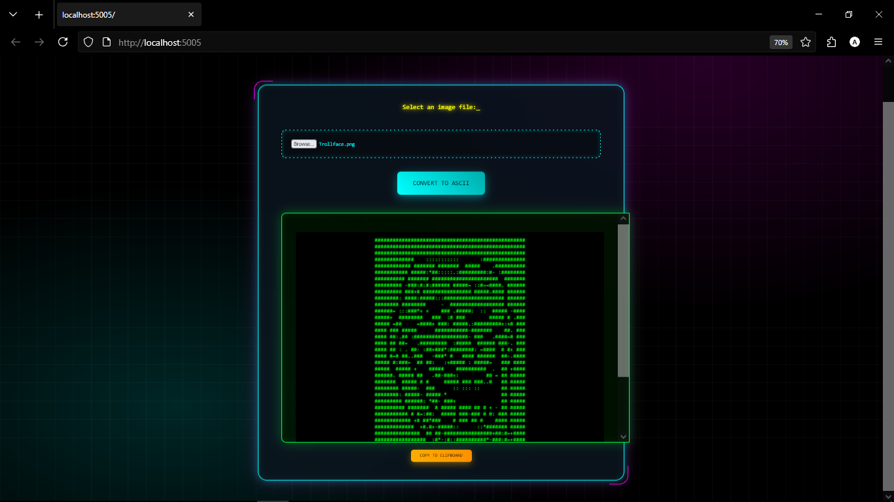

# ASCII Generator Web (ASP.NET Core)

A web application built with ASP.NET Core that converts any user-provided image into ASCII art. The application features a dynamic, retro-futuristic cyberpunk interface.



## Features

* **ASP.NET Core Backend:** A solid foundation serving the web application.
* **Client-Side Image Processing:** Utilizes the browser's Canvas API to read image data and perform the conversion locally, ensuring no image data is uploaded to the server.
* **Dynamic ASCII Conversion:** Translates the brightness levels of image pixels into a corresponding set of ASCII characters.
* **Immersive Interface:** A fully custom-styled front-end with a retro-futuristic aesthetic, featuring:
    * Animated backgrounds with panning grids and radial glows.
    * A "floating" main container with a 3D perspective effect.
    * An animated screen-scanner line for a classic CRT monitor feel.
* **Copy to Clipboard:** Allows the user to easily copy the generated ASCII art with a single button press.

## Technologies Used

* **Backend:** C#, ASP.NET Core
* **Frontend:**
    * HTML5
    * CSS3 (Keyframe Animations, Flexbox, Backdrop Filter)
    * JavaScript (ES6+)
* **APIs:**
    * Canvas API
    * FileReader API
    * Clipboard API

## Prerequisites

You must have the **.NET SDK** installed on your machine. You can download it from the official .NET website.

## Setup and Usage

1.  Clone the repository:
    ```bash
    git clone [https://github.com/atymri/ASCIIGenerator_Web.git](https://github.com/atymri/ASCIIGenerator_Web.git)
    ```
2.  Navigate to the project directory:
    ```bash
    cd ASCIIGenerator_Web
    ```
3.  Run the application using the .NET CLI:
    ```bash
    dotnet run
    ```
4.  The application will start, and you can access it in your web browser at the address provided in the console.

## License

This project is licensed under the MIT License. See the `LICENSE` file for details.
